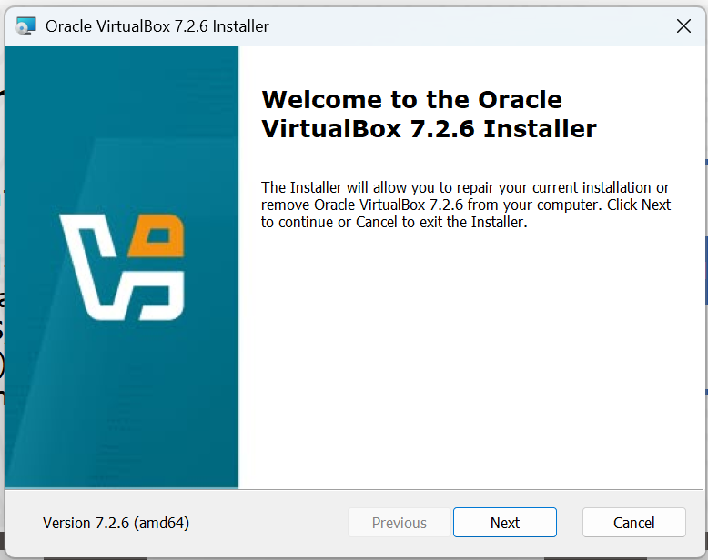
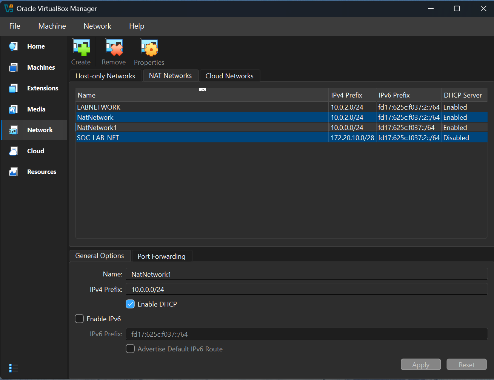
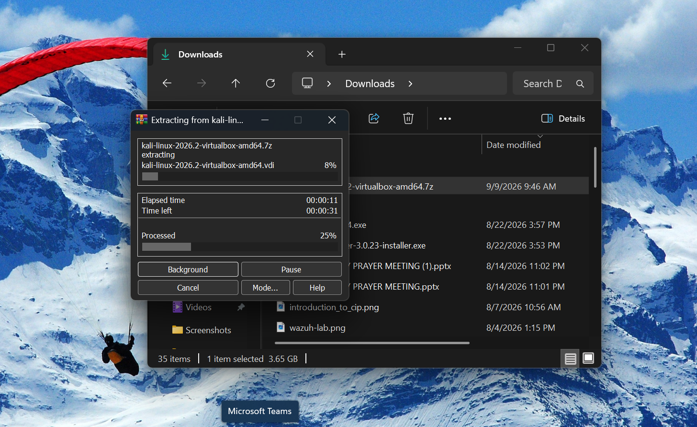
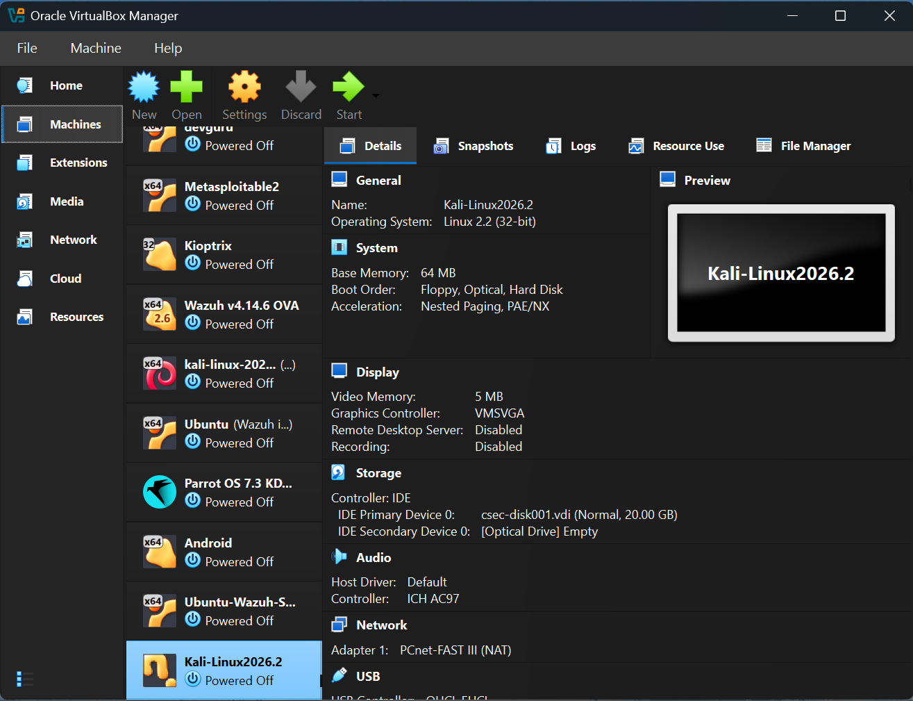
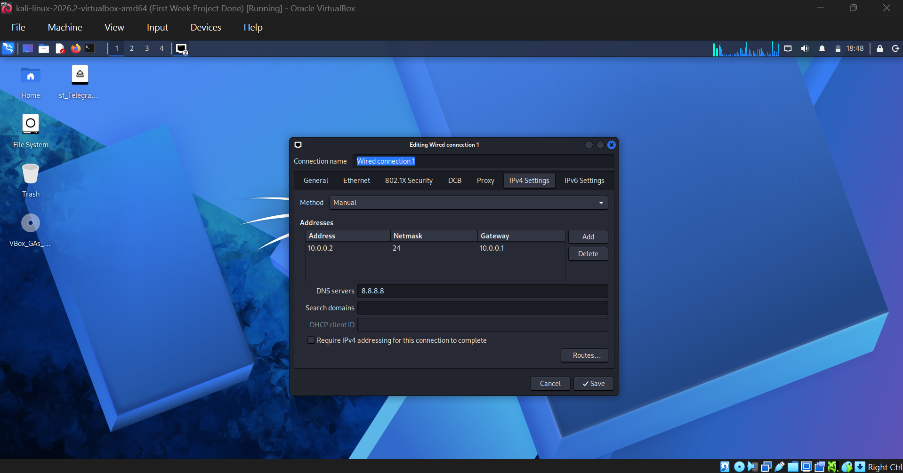
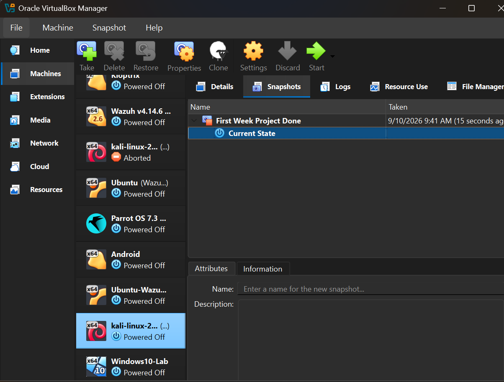
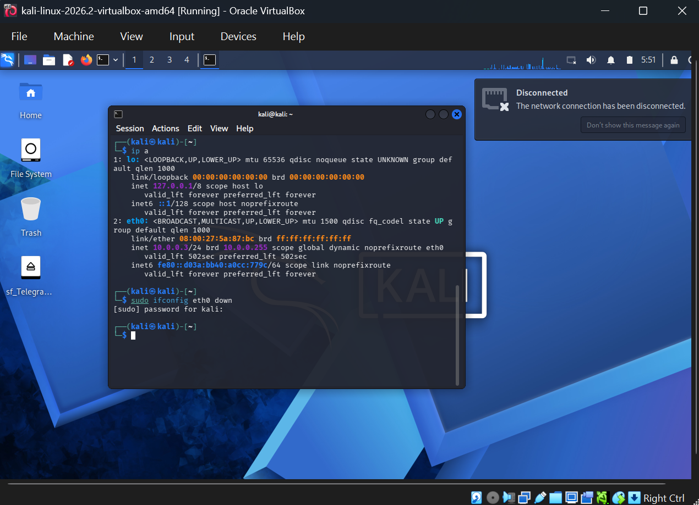
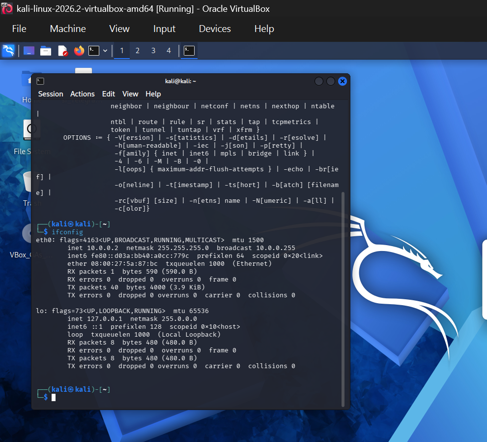

# 🔐 Cybersecurity Lab Environment Setup

### Building an isolated virtual lab for penetration testing and ethical hacking practice


---

## 📌 Project Overview

This project focuses on setting up a virtual cybersecurity and penetration-testing laboratory using Oracle VirtualBox and Kali Linux.

The purpose of the lab is to create a controlled environment where cybersecurity tools, network scanning, reconnaissance, vulnerability assessment, and other security-testing activities can be performed safely and repeatedly.

The laboratory is configured on a private virtual network to provide a controlled environment for cybersecurity and ethical hacking practice.

---

## 🎯 Project Objectives

- Install and configure Oracle VirtualBox.
- Create and configure a dedicated NAT Network.
- Install Kali Linux.
- Configure Kali Linux networking.
- Create a clean virtual machine snapshot.
- Troubleshoot and resolve network connectivity issues.
- Document the complete setup process on GitHub.

---

## 🏗️ Lab Architecture

```text
                 ┌──────────────────────────┐
                 │      Host Computer       │
                 │       Windows 11         │
                 └────────────┬─────────────┘
                              │
                       Oracle VirtualBox
                              │
                ┌─────────────▼─────────────┐
                │       NatNetwork1         │
                │       10.0.0.0/24         │
                │      Gateway: 10.0.0.1    │
                └─────────────┬─────────────┘
                              │
                     ┌────────▼────────┐
                     │    Kali Linux   │
                     │   10.0.0.2/24   │
                     │                 │
                     │ Testing Machine │
                     └─────────────────┘
```

## Lab Configuration
| Component               | Configuration                            |
| ----------------------- | ---------------------------------------- |
| Virtualization Platform | Oracle VirtualBox 7.2.6                  |
| Primary Security VM     | Kali Linux 2026.2                        |
| Kali Interface          | `eth0`                                   |
| Kali IP Address         | `10.0.0.2/24`                            |
| Network Type            | NAT Network                              |
| Network Name            | `NatNetwork1`                            |
| Network Address         | `10.0.0.0/24`                            |
| Gateway                 | `10.0.0.1`                               |
| DNS                     | `8.8.8.8`                                |
| Purpose                 | Cybersecurity / Ethical Hacking Practice |


## 🛠️ Tools and Technologies
- Oracle VirtualBox
- Kali Linux
- Linux Networking
- NetworkManager
- ICMP / Ping
- GitHub
- Cybersecurity and penetration-testing tools

## 🪜 Lab Setup Procedure

### Step 1 — Install Oracle VirtualBox

Oracle VirtualBox 7.2.6 was installed and configured as the virtualization platform for the cybersecurity laboratory.

### Evidence 1 — VirtualBox Installation



### Step 2 — Configure the Virtual Network

A dedicated NAT Network named NatNetwork1 was configured for the laboratory environment.

## Network Configuration

```
IP Address: 10.0.0.0/24
Gateway:    10.0.0.1
DNS:        8.8.8.8
```

### Evidence 2 — Virtual Network Configuration




### Step 3 — Install Kali Linux

Kali Linux 2026.2 was installed as the primary cybersecurity testing machine.

Kali Linux provides the operating environment for cybersecurity tools and ethical hacking practice.


### Evidence 3 — Kali Linux Installation

The Kali Linux virtual machine was extracted and successfully added to Oracle VirtualBox.





### Step 4 — Configure Kali Linux Networking

The Kali Linux network interface eth0 was configured for the laboratory network.

## Network Configuration

```
Interface:  eth0
IP Address: 10.0.0.2/24
Gateway:    10.0.0.1
DNS:        8.8.8.8
```

### Evidence 4 — Kali Linux Network Configuration




## Verification Commands

```bash
ip -br link
ip -br addr
ip route
nmcli device status
```
These commands were used to verify the network interface, IP configuration, routing information, and NetworkManager status.


### Step 5 — Create a Clean Virtual Machine Snapshot

A clean snapshot was created after the initial Kali Linux laboratory configuration.

The snapshot provides a recovery point that can be used to restore the laboratory environment before conducting future cybersecurity experiments.

### Evidence 5 — Clean Virtual Machine Snapshot




## 🐞 Troubleshooting Experience

### Problem — Kali Network Interface Disconnected

During manual network configuration, I initially used:

```bash
sudo ip eth0 down
```

This caused the network interface to become disconnected.

### Evidence 6 — Interface Shutdown



I then attempted to bring the interface back up using:

```bash
sudo ip eth0 up
```

However, the command syntax was incorrect and did not restore the interface.

## 🔎 Diagnosis

I investigated the network interface and NetworkManager status using:

```bash
ip -br link
ip -br addr
nmcli device status
nmcli connection show
```

The affected interface was confirmed as:

```bash
eth0
```

The interface was initially reported as disconnected by NetworkManager.

## ✅ Solution

I used the correct Linux networking syntax:

```bash
sudo ip link set eth0 up
```

I then restarted NetworkManager to re-establish the network connection:

```bash
sudo systemctl restart NetworkManager
```

After these changes, the network connection was restored.

The final configuration was verified using:

```bash
nmcli device status
ip -br addr
ip route
```

The interface was confirmed to be operational and connectivity was successfully restored.

### Evidence 7 — Network Configuration Verification



## 💡 Lessons Learned

### This troubleshooting experience reinforced the importance of:

- Using the correct Linux networking command syntax.
- Identifying the correct network-interface name before making changes.
- Understanding the difference between an interface being UP and having a working IP configuration.
- Checking NetworkManager when connectivity problems occur.
- Verifying VirtualBox network configuration.
- Testing connectivity after network changes.
- Following a structured troubleshooting process:

## Troubleshooting Methodology
```text
  Identification
        ↓
  Diagnosis
        ↓
  Remediation
        ↓
  Verification
```

## 🔐 Security & Ethical Use

This laboratory is intended strictly for:

- Authorized cybersecurity training
- Ethical hacking practice
- Network security testing
- Vulnerability assessment
- Controlled penetration-testing exercises

Security testing should never be performed against systems without explicit authorization.

## 📸 Project Evidence

### VirtualBox Installation


### Virtual Network Configuration


### Kali Linux Installation

The Kali Linux virtual machine was extracted and successfully added to Oracle VirtualBox.


### Kali Linux Network Configuration


### Clean Virtual Machine Snapshot


### Interface Shutdown


### Network Configuration Verification


## 📊 Project Status
- [x] Oracle VirtualBox installed
- [x] NAT Network configured
- [x] Kali Linux 2026.2 installed
- [x] Kali network interface configured
- [x] Network connectivity restored
- [x] Troubleshooting completed
- [x] GitHub repository created
- [x] Evidence screenshots added
- [x] NetworkWalks Week 1 submission

## 👤 Author

**Banjo Oluwatobiloba Adekunle**

Aspiring Cybersecurity Analyst | Network Security Enthusiast  
ISC² Certified in Cybersecurity (CC)  
CompTIA Security+

🔗 **LinkedIn:** https://www.linkedin.com/in/oluwatobiloba-banjo-b2368819b/

💻 **GitHub:** https://github.com/oluwatobilobacybers-lang

## 📌 Project Information

This project is part of my practical cybersecurity internship at NetworkWalks.

**Week:** 01  
**Project:** Cybersecurity & Pentesting Lab Setup  
**Repository:** GitHub

The project focuses on building practical cybersecurity skills through controlled laboratory environments.
